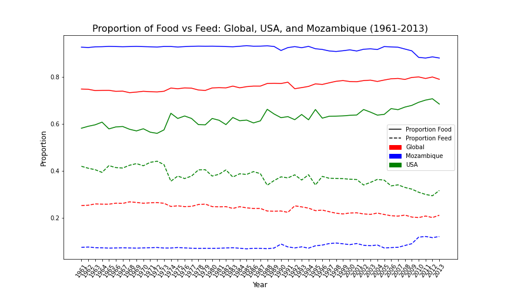
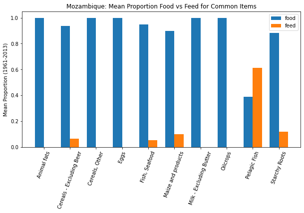
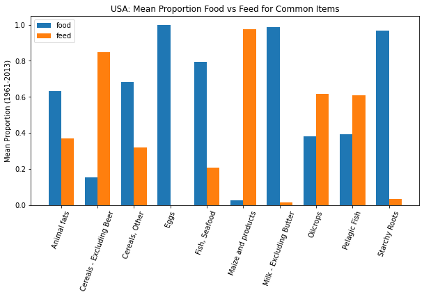
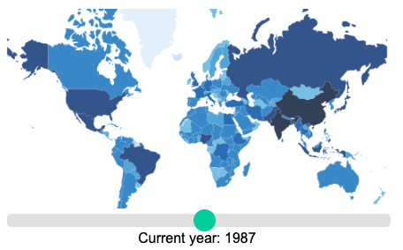
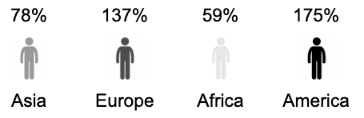
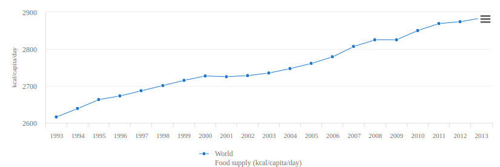

# Project of Data Visualization (COM-480)

| Student's name    | SCIPER |
| ----------------- | ------ |
| Lucas Rollet      | 323391 |
| Tianzong Zhang    | 299091 |
| Meghan Harrington | 342183 |

[Milestone 1](#milestone-1) • [Milestone 2](#milestone-2) • [Milestone 3](#milestone-3)

## Milestone 1 (8th April, 5pm)

**10% of the final grade**

This is a preliminary milestone to let you set up goals for your final project and assess the feasibility of your ideas.
Please, fill the following sections about your project.

_(max. 2000 characters per section)_

### Dataset

<!-- > Find a dataset (or multiple) that you will explore. Assess the quality of the data it contains and how much preprocessing / data-cleaning it will require before tackling visualization. We recommend using a standard dataset as this course is not about scraping nor data processing.
>
> Hint: some good pointers for finding quality publicly available datasets ([Google dataset search](https://datasetsearch.research.google.com/), [Kaggle](https://www.kaggle.com/datasets), [OpenSwissData](https://opendata.swiss/en/), [SNAP](https://snap.stanford.edu/data/) and [FiveThirtyEight](https://data.fivethirtyeight.com/)), you could use also the DataSets proposed by the ENAC (see the Announcements section on Zulip). -->

Two datasets regarding food balance are involved in our data visualization project: [**Food Balances (-2013)**](https://www.fao.org/faostat/en/#data/FBSH) and [**Food Balances (2010-)**](https://www.fao.org/faostat/en/#data/FBS), both released and maintained by [the Food and Agriculture Organization of the United Nations (FAO)](https://www.fao.org/home/en). Both datasets contain the quantity of food supplied and consumed for each country, each food type and each year. However, the two datasets have different timespans: **Food Balances (-2013)** covers a data timespan from 1960 to 2013, while **Food Balances (2010-)** contains data from 2010 to 2019. According to the [explanation from FAO](https://fenixservices.fao.org/faostat/static/documents/FBS/Key%20differences%20between%20new%20and%20old%20Food%20Balance%20Sheet_Dec2020.pdf), the data are split into two datasets because there was a change of methodology for collecting and presenting the data. It is possible to merge the two datasets.

The data downloading webpage allows one to download a portion of dataset by selecting a subset of features. In our project, we simply download the whole dataset by using the "bulk download" option for further data analysis and visualization. Both datasets are rather clean and does not require much data cleaning. However we comment that there are missing data in the dataset, as depicted in the exploratory data analysis section below.

The datasets used in our project are two csv files, and the download links to the specific files are given below:

- [FoodBalanceSheetsHistoric_E_All_Data.csv](https://fenixservices.fao.org/faostat/static/bulkdownloads/FoodBalanceSheetsHistoric_E_All_Data.zip): csv file for dataset **Food Balances (-2013)**;
- [FoodBalanceSheets_E_All_Data.csv](https://fenixservices.fao.org/faostat/static/bulkdownloads/FoodBalanceSheets_E_All_Data.zip): csv file for dataset **Food Balances (2010-)**.

### Problematics

Food is a major concern wordlwide and it is problem that is expected to get even worse year by year due to global warming and climate concerns. Nowadays, one-third of our greenhouse gas emissions comes from the agriculture sector. The world population is expected to grow by 2 billion in 2050, and feeding the world has become an increasingly concerning problem. Still, a big part of the grain harvested goes towards the meat industry, to feed livestocks. One of the main reasons is that over the past 50 years, our meat production has almost quadrupled - implying needs for more and more resources.

Our goal in this project will be to visualize the share of produced food that goes towards the breeding industry, and what is used to actually feed citizens. We would like to show that the amount of food dedicated to producing meat is way to big and that it could be used differently if we choose to adapt our diet a bit to at least reduce the amount of meat we eat. We think it is a very important and meaningful topic in today's era. We would like to make this information easily accessible and easy to visualize for everybody, without requiring any background knowledge on the topic.

To do so, we plan to visualize on a map the quantities of food each country exports and imports, and then to have detailed plots for every country showing the amount of food dedicated to livestocks, and the amount of food dedicated to citizens. For every country, we will also have access to data regarding the most consumed types of food as well as how well inhabitants are nourished. This visualization should be able to help us pinpoint problems about food repartition, e.g. countries starving but exporting lots of grains, or countries that dedicate a too high share of what they produce to breeding livestock. We also want to build an overall tendency by averaging the data world-wide to have a broad overview of the topic. We also want to show how this trend evolved over the years.

### Exploratory Data Analysis

For some initial exploration of the data, we look at a broad overview of the proportions of food allocated for human consumption in comparison to food allocated for animal consumption. To get a general idea of the trends in different countries, we choose a rich country, a poor country, and also look at the global trend. This analysis uses the dataset from before 2013, but for the following milestones, we intend to include more recent data as well.
In the following plot, we can see how the food vs feed proportions for all food products combined has changed over time. In addition, we can also see the differences between the United States and Mozambique. We observe that in Mozambique, the gap between food and feed is much greater. In the United States, especially in the earlier years, the split between food and feed is much closer to 50-50. It appears that this gap has grown over time. It will be interesting to see what changes have occurred in more recent years. In our project, we would like to offer visualizations that can convey these patterns, but on a global scale and with more detail. The following three plots are created in [this notebook](https://github.com/com-480-data-visualization/datavis-project-2022-datagang/blob/master/m1eda.ipynb).

Another interesting factor that we can look at is the different types of food products, how they are distributed among countries, and how they are allocated within countries. For the sake of this initial exploration, we once again choose USA and Mozambique to get a stark comparison. These plots add some more insight to what we observed in the previous graph. Here, we observe the proportions of food and feed for the ten most common food items in the dataset. In Mozambique, there are many food categories that are not provided for animal consumption at all; whereas in the US, there is only one such category (Eggs).

  
  

This initial exploration shows some of the patterns that we hope to visualize in an engaging and intuitive way.

### Related work

An interactive visualization that we found using this dataset is an [animated bar chart](https://ourworldindata.org/grapher/cereal-allocation-by-country?time=2002&country=USA~GBR~CHN~IND~TCD~NGA~BRA~DEU~CAN~OWID_WRL) showing the countries that provide the highest proportion of food to humans. Additionally, there are some [research papers](https://edepot.wur.nl/532420) linked to it focusing on the sustainability aspect.
A [kaggle entry](https://www.kaggle.com/datasets/dorbicycle/world-foodfeed-production) also uses a subset of this dataset. There are quite a lot of data analyses made, but not many visualizations.
We don't plan to reuse any of these visualizations, but they can provide some overview of the dataset.
Some examples of visualizations realised on this dataset are:

- [Production Visualization on a World Map](https://www.kaggle.com/code/kumarpranay/production-visualization-on-a-world-map)
- [Who eats what we grow ?](https://www.kaggle.com/code/preetmehta/who-eat-what-we-grow)
- [The visualization available on the data provider website](https://www.fao.org/faostat/en/#data/FBSH/visualize)

Even if our approach is not revolutionary in the data visualization world, our main goal is to make our visualization as interactive as possible to make the data accessible and fun to interact with. We want to really focus on the simplicity of use to convey our message in an effective way.

One source of inspiration is [Feeding America](https://public.tableau.com/app/profile/feeding.america.research/viz/TheHealthcareCostsofFoodInsecurity/HealthcareCosts). They provide some nice map-based visualizations related to food insecurity. The visualizations are focused on the United States and the topic is slightly different, but we can definitely take inspiration from the format.

The [World Poverty website](https://worldpoverty.io/map) also provides some engaging visualizations, including one with a map interface. Our goal is to provide a similar style of visualization in a polished, engaging, and easy-to-use fashion.

## Milestone 2 (7th May, 5pm)

**10% of the final grade**

### Visualizations

  

The core visualization for our project will be a world map. The idea is to color each country by a chosen preset. Depending on how far we progress, the variety of presets could differ, but the two main things that we would like to visualize are the food vs feed supply and the overall global food supply. So, for example, if the user were to select global food supply, the countries on the map would be colored according to their food supply per capita. This will allow for a clear comparison of food availability among all countries. The other primary issue we want to visualize is the allotment of food for human consumption versus for feeding livestock. For this visualization, we can color the countries according to the proportion of food they allocate for human consumption and then by the proportion of food they allocate for livestock.

In order to view the evolution of global trends over time, there will be a timeline along the bottom of the map. In addition to looking at global trends, when a particular country is clicked on, a pop-up will appear with more precise information specific to that country.

To the right of the main map, we will include two complementary visualizations. These visualizations will also adjust according to the same timeline used for the main map. In order to convey the information in a straightforward manner, we will just look at continental trends for the first one. The idea is to show what percentage of the population in a continent could be fed by that continent’s food supply. For example, we will take the population of a continent and the yearly food necessity for a person and calculate how much food is needed to sufficiently feed the population for a year. Then, we will compare that number with the food supply of a continent for a given year, using the aggregated data for that continent. We will visualize this difference by representing each continent by icons of people and coloring them according to the percentage of the population that could be fed with the yearly food supply.

  

We expect to see that richer continents have a surplus of food, while poorer continents may have a deficiency.
Below this, we will visualize the total global food supply over time using a line graph.

  

### Tools
* Pandas, numpy for data processing
* HTML (Lecture 1)
* CSS (Lecture 1)
* JavaScript (Lectures 2 and 3)
* D3.js (Lecture 4)
* Interaction (Lecture 5)
* Perception colors (Lecture 6)
* Maps (Lecture 8)
* Tabular Data (Lecture 11)

For the overall website, we will need tools such as HTML and CSS. Interactive widgets can be implemented using JavaScript. As the main focus of the project is a dataset, D3.js will be an essential tool. For our core visualization, we are creating a map; therefore, the maps lecture will be an useful reference. The lectures addressing perception colors, interaction, and tabular data could also be of use.

## Milestone 3 (4th June, 5pm)

**80% of the final grade**

## Late policy

- < 24h: 80% of the grade for the milestone
- < 48h: 70% of the grade for the milestone
